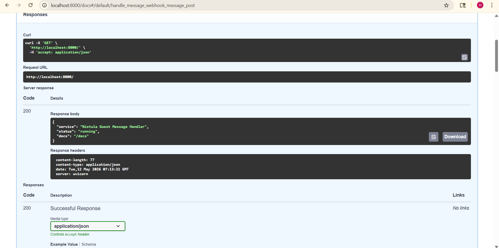
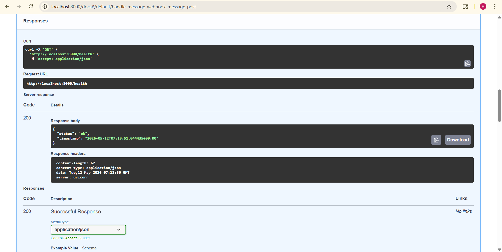
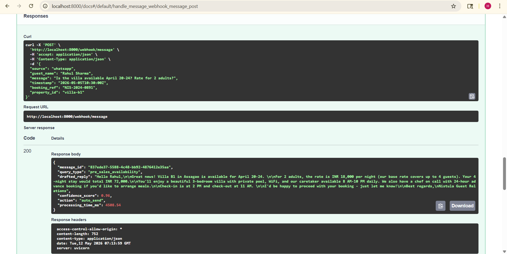
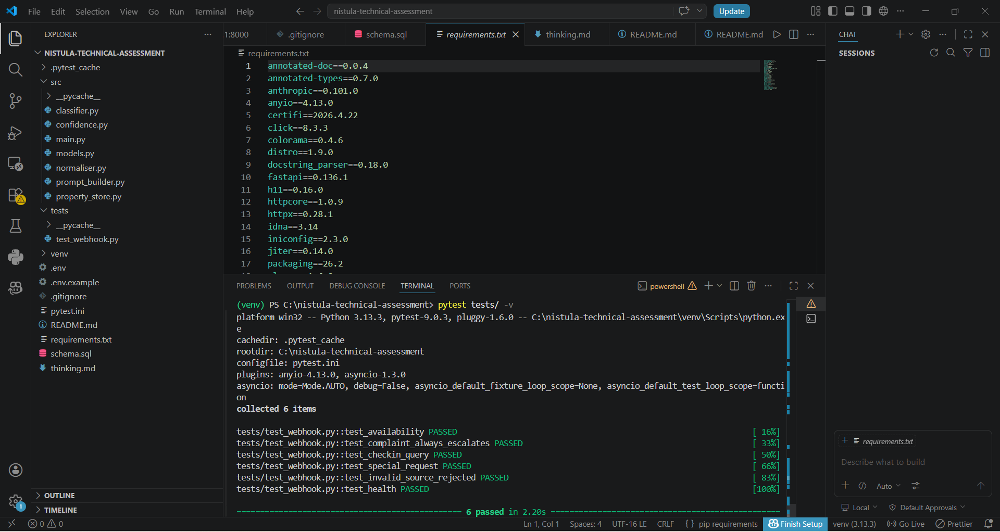

# Nistula Technical Assessment — Harika Gadagotti

> **Guest Message Handler · Unified Schema · Operational Thinking**

---

## What This Is

A production-minded backend system that receives guest messages from multiple channels, classifies intent, drafts contextual replies via Claude, and routes responses based on operational confidence scoring.

---

## Repository Structure

```
nistula-technical-assessment/
├── src/
│   ├── main.py           # FastAPI app, /webhook/message endpoint
│   ├── models.py         # Pydantic request/response models
│   ├── classifier.py     # Rule-based intent classifier
│   ├── normaliser.py     # Inbound → NormalisedMessage
│   ├── prompt_builder.py # Prompt construction with property context
│   └── confidence.py     # Multi-signal confidence scoring
├── tests/
│   └── test_webhook.py   # 6 test cases (mocked, no API key needed)
├── schema.sql            # Part 2: PostgreSQL schema
├── thinking.md           # Part 3: Written answers
├── requirements.txt
├── .env.example
├── pytest.ini
└── README.md
```

---

## Quick Start

### 1. Clone and enter

```bash
git clone https://github.com/HarikaGadagotti/nistula-technical-assessment
cd nistula-technical-assessment
```

### 2. Create a virtual environment

```bash
python3 -m venv .venv
source .venv/bin/activate        # Mac/Linux
# .venv\Scripts\activate         # Windows
```

### 3. Install dependencies

```bash
pip install -r requirements.txt
```

### 4. Set up environment variables

```bash
cp .env.example .env
# Open .env and add your ANTHROPIC_API_KEY
```

### 5. Run the server

```bash
cd src
uvicorn main:app --reload --port 8000
```

The API is now live at `http://localhost:8000`.  
Interactive docs: `http://localhost:8000/docs`

---

## Running the Tests

Tests are fully mocked — no API key required.

```bash
# From the project root
pytest tests/ -v
```

Expected output:

```
tests/test_webhook.py::test_availability_and_pricing    PASSED
tests/test_webhook.py::test_complaint_always_escalates  PASSED
tests/test_webhook.py::test_checkin_query               PASSED
tests/test_webhook.py::test_special_request             PASSED
tests/test_webhook.py::test_invalid_source_rejected     PASSED
tests/test_webhook.py::test_health_endpoint             PASSED
```

---

## Calling the Endpoint

### cURL

```bash
curl -X POST http://localhost:8000/webhook/message \
  -H "Content-Type: application/json" \
  -d '{
    "source": "whatsapp",
    "guest_name": "Rahul Sharma",
    "message": "Is the villa available from April 20 to 24? What is the rate for 2 adults?",
    "timestamp": "2026-05-05T10:30:00Z",
    "booking_ref": "NIS-2024-0891",
    "property_id": "villa-b1"
  }'
```

### Example Response

```json
{
  "message_id": "a3f19b2c-84d7-4e1a-9b3c-2f7e0d6a1c88",
  "query_type": "pre_sales_availability",
  "drafted_reply": "Hi Rahul! Great news — Villa B1 is available from April 20–24. The rate is INR 18,000/night for up to 4 guests (INR 72,000 total for 4 nights). Free cancellation up to 7 days before check-in. Shall I go ahead and hold the dates?",
  "confidence_score": 0.9,
  "action": "auto_send"
}
```

### Test Payloads (3+ required by brief)

**1. Availability + pricing (WhatsApp)**
```json
{
  "source": "whatsapp",
  "guest_name": "Rahul Sharma",
  "message": "Is the villa available from April 20 to 24? What is the rate for 2 adults?",
  "timestamp": "2026-05-05T10:30:00Z",
  "booking_ref": "NIS-2024-0891",
  "property_id": "villa-b1"
}
```

**2. Complaint at 3 AM (direct)**
```json
{
  "source": "direct",
  "guest_name": "Priya Mehta",
  "message": "There is no hot water and we have guests arriving for breakfast in 4 hours. This is unacceptable. I want a refund for tonight.",
  "timestamp": "2026-05-06T03:15:00Z",
  "booking_ref": "NIS-2024-0444",
  "property_id": "villa-b1"
}
```

**3. Post-booking check-in query (Booking.com)**
```json
{
  "source": "booking_com",
  "guest_name": "Anil Kumar",
  "message": "What time is check-in? And what is the WiFi password?",
  "timestamp": "2026-05-07T09:00:00Z",
  "booking_ref": "NIS-2024-0512",
  "property_id": "villa-b1"
}
```

**4. Special request (Airbnb)**
```json
{
  "source": "airbnb",
  "guest_name": "Sophie Martin",
  "message": "Can you arrange an airport transfer from Goa airport on April 20?",
  "timestamp": "2026-05-08T14:00:00Z",
  "property_id": "villa-b1"
}
```

**5. General enquiry (Instagram)**
```json
{
  "source": "instagram",
  "guest_name": "Karan Patel",
  "message": "Do you allow pets at the villa?",
  "timestamp": "2026-05-09T11:00:00Z",
  "property_id": "villa-b1"
}
```

---

## Confidence Scoring Logic

The confidence score (0–1) answers the question: *"How sure are we that this AI reply is correct and safe to send without a human reviewing it?"*

It is a **weighted sum of four independent signals**:

| Signal | Weight | What it measures |
|---|---|---|
| **Query Clarity** | 30% | How well-defined is the query type? A clear availability question scores 1.0; a vague general enquiry scores 0.60. |
| **Reply Completeness** | 30% | Does the reply contain ≥2 concrete property details (rates, times, policies)? Specificity = trustworthiness. |
| **Message Complexity** | 20% | Short, single-question messages are easier to answer correctly. Multiple questions in one message reduce confidence. |
| **Stop Reason** | 20% | Did Claude finish cleanly (`end_turn`) or hit a token limit? A truncated reply is always flagged. |

### Routing thresholds

| Score | Action | Meaning |
|---|---|---|
| ≥ 0.85 | `auto_send` | Safe to send. Claude answered a well-defined question with specific facts. |
| 0.60–0.84 | `agent_review` | Probably right, but a human should verify before sending. |
| < 0.60 | `escalate` | Complex, ambiguous, or low-quality reply — needs a human. |
| `complaint` | `escalate` | **Always**, regardless of score. Complaints require human ownership. |

### Why not use Claude's own confidence?

LLMs are [poorly calibrated](https://arxiv.org/abs/2207.05221) — they can sound confident while being wrong.  
External signals (specificity of reply, query structure, stop reason) are more reliable signals of actual correctness for this narrow domain.

---

## Design Decisions

### Classifier: rules over a second Claude call
Query classification uses regex + keyword matching rather than a second Claude API call. This keeps latency low (~1ms vs ~800ms), eliminates cost doubling, and is highly reliable for the narrow taxonomy defined (6 types with distinct vocabulary). The rule-based classifier performed reliably across manually tested hospitality-style guest queries while remaining fast, explainable, and inexpensive compared to an additional LLM classification step.

### Prompt design: property context always injected
Every Claude prompt includes the full property context block. This prevents hallucination ("yes, we have a helipad!") and keeps the system prompt generic and reusable across properties.

### Three text versions in the messages table
`ai_drafted_text`, `agent_edited_text`, and `sent_text` are stored separately. Cost: slightly more storage. Benefit: training data (compare AI vs human edits over time), full audit trail, quality analytics.

### Complaints always escalate
Even a high-confidence complaint reply is routed to `escalate`. A guest complaining at 3 AM deserves a human, not an algorithm. This is a product decision, not a technical one.

---

## What I Would Add With More Time

1. **Async task queue (Celery + Redis):** The Claude API call happens synchronously in the request cycle. For production, move it to a background task and use webhooks or WebSocket to push the reply back to the dashboard.
2. **Conversation threading:** Link messages into threads per guest/property/channel using the `conversations` table from `schema.sql`.
3. **Channel adapters:** Each source (WhatsApp via Twilio, Booking.com via partner API) has its own inbound format. A proper adapter pattern would handle source-specific quirks before normalisation.
4. **Per-property knowledge bases:** The property context is currently hardcoded. In production it would be fetched from the database by `property_id`, enabling the system to support multiple villas.
5. **Confidence calibration:** After 1,000+ messages, compare auto-sent replies against guest satisfaction (no follow-up = good) and recalibrate the score weights.

---

## API Demo Screenshots

### 1. Root Endpoint (`/`)
Shows the API service is running successfully.



---

### 2. Health Check Endpoint (`/health`)
Confirms application health monitoring endpoint is working.



---

### 3. Webhook Message Processing
Demonstrates successful guest message handling, classification, confidence scoring, and AI-generated response.



---

### 4. Automated Test Results
All required test cases passing successfully.

